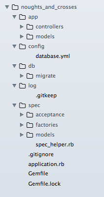

Кіраўнік # 2. Кіраванне базай дадзеных і агульная структура прыкладання
=======================================================================

У гэтай частцы мы створым сэрвіс для простай гульні Tic Tac Toe (крыжыкі-нулікі), мы будзем надаваць больш увагі структуры прыкладання і задачах кіравання базай данныx: для стварэння базы дадзеных, для стварэння міграцыі, выкананне і адмены міграцыі.

Мы будзем захоўваць гульнявыя запісы ў рэляцыйнай базе дадзеных (а менавіта PostgreSQL, але вы можаце выкарыстоўваць і іншыя, такія як SQLite або MySQL). Запіс гульні захоўвае сваю дошку (поле гульні), пасля стварэння дошка пустая. Вэб-сэрвіс дазваляе гульцу рабіць ход на клетцы дошкі (палі), пасля чаго сэрвіс робіць уласны ход і вяртае абноўленае ўяўленне гульні ў тэкставым фармаце.

Вось ўяўленне пустога гульнявога поля:

       |   |
    -----------
       |   |
    -----------
       |   |

А тут, як гэта можа выглядаць пасля першага ходу:

       |   |
    -----------
     O | X |
    -----------
       |   |

## <a name="service-interface"></a>Інтэрфейс вэб-сэрвісу

Гулец павінен быць у стане стварыць гульню даслаўшы `POST` запыт на URL `"games.txt"`.

    $ curl -X POST "localhost:4567/api/v1/games.txt"
    Game #1
    Status: In Progress

       |   |
    -----------
       |   |
    -----------
       |   |

Таксама гулец павінен быць у стане зрабіць ход, даслаўшы `PUT` запыт на URL канкрэтнай гульні (з ID) з нумарам ячэйкі, дзе гулец жадае паставіць крыжык (сімвал "X").

    $ curl -X PUT "localhost:4567/api/v1/games/1.txt?game%5Bmove%5D=4"
    Game #1
    Status: In Progress

       |   |
    -----------
     O | X |
    -----------
       |   |

Сэрвіс робіць свой ход - кампутар ставіць "0" на пустое вочка (калі гульня не сканчаецца пасля ходу гульца), і паведамляе пра стан гульні: "У працэсе", "Выйграць", "Прайграла", "Нічыя". Звярніце ўвагу, што гулец перадае параметры гульні, у дадзеным выпадку гэта GET параметры (частка URL), але ўвогуле гэта павінны быць параметры POST (перададзеныя ў целе запыту HTTP) - даўжыня URL абмяжоўваецца ў залежнасці ад вэб-сервера, так што ў цэлым мы павінны выкарыстоўваць POST. Пакуль жа будзем выкарыстоўваць GET для некаторай прастаты.

Параметры гульні - гэта сховішча ключоў і значэнняў, якое ўтрымлівае толькі адзін ключ - "move" (ход), значэнне - гэта нумар ячэйкі, у якой гулец хоча паставіць крыжык (сімвал "X"). Вочка павінна быць пустой для таго, каб была магчымасць зрабіць у яе ход. Ячэйкі пранумараваны ад 0 да 9 (гэта не правілы гульні, а наша ўяўленне пра поле гульні, для таго, каб мець магчымасць зрабіць ход):

     0 | 1 | 2
    -----------
     3 | 4 | 5
    -----------
     6 | 7 | 8

Калі гульня не скончана гулец можа зрабіць новы ход.

Гульня завершана калі яна выйграная або прайграна, ці не больш пустых вочак на поле. Гульня лічыцца выйгранай (гульцом), калі тры крыжыка размешчаны на адной лініі (гарызантальнай, вертыкальнай або дыяганальнай). Гульня лічыцца прайгранай (гульцом), калі тры нулікі знаходзяцца на адной лініі.

## <a name="games-model-interface"></a>Інтэрфейс мадэлі гульні

Наша гульнявая мадэль павінна выглядаць сябе наступным чынам:

```ruby
# created new game with empty board.
game = Game.create

# Game has it's own unique ID
game.id

# making a move (computer makes countermove and saves record into database)
game.update_attributes(move: 4)

# Game status: "In Progress", "Won", "Lost", "Drow"
gmae.status

# Array of board cells: each value equals one of strings "X", "O" or ""
game.cells
```

## <a name="create-skeleton-of-the-service"></a>Стварэнне структуры сэрвісу

Стварыце ласка тэчку `noughts_and_crosses` і файл `Gemfile` ў ёй са спісам неабходных гемов:

```ruby
source 'https://rubygems.org'

gem 'rake'
gem 'sinatra'
gem 'pg'
gem 'activerecord'
gem 'protected_attributes'
gem 'sinatra-activerecord'

group :development, :test do
  gem 'thin'
  gem 'pry-debugger'
end

group :test do
  gem 'rspec'
  gem 'shoulda'
  gem 'factory_girl'
  gem 'database_cleaner'
  gem 'rack-test'
end
```

У тэрмінале, перайдзіце ў тэчку `noughts_and_crosses` і выканайце `bundle install`. Мы падзялілі гемы на групы: некаторыя з іх патрэбныя толькі ў `test` рэжыме, некаторыя толькі в `test` і `development`.

Звярніце ўвагу на гем `sinatra-activerecord`, ён аўтаматычна ўсталёўвае злучэнне з базай дадзеных з дапамогай канфігурацыйнага файла `config/database.yml` і дадае `rake` задачы для кіравання базай дадзеных.

Цяпер стварыце файл `application.rb` ў тэчцы `noughts_and_crosses`, гэта будзе асноўны файл сэрвісу.

```ruby
require 'bundler/setup'
Bundler.require :default, (ENV['RACK_ENV'] || :development).to_sym
puts "Loaded #{Sinatra::Application.environment} environment"

set :root, File.dirname(__FILE__)
use Rack::CommonLogger, File.new(File.join(settings.root, 'log',
  "#{settings.environment}.log"), 'a+').tap { |f| f.sync = true }

Dir[File.join(settings.root, "app/models/*.rb")].each do |f|
  autoload File.basename(f, '.rb').classify.to_sym, f
end
Dir[File.join(settings.root, "app/controllers/*.rb")].each { |f| require f }

before do
  content_type :txt
end

error(ActiveRecord::RecordNotFound) { [404, "There is no Game with provided id"] }
error(ActiveRecord::RecordInvalid) { [422, env['sinatra.error'].record.errors.full_messages.join("\n")] }
error { "An internal server error occurred. Please try again later." }
```

Давайце пройдземся па кодзе па маленькіх частках

```ruby
require 'bundler/setup'
Bundler.require :default, (ENV['RACK_ENV'] || :development).to_sym
puts "Loaded #{Sinatra::Application.environment} environment"
```

Тут мы загружаем ўсе гемы для выкарыстоўванага рэжыму (`environment`). Мы можам запусціць сэрвіс у розных асяроддзях, перадаючы параметр `RACK_ENV`. Па змаўчанні выкарыстоўваецца `development`

    RACK_ENV=production ruby application.rb

Далей, задаем каранёвую тэчку.

```ruby
set :root, File.dirname(__FILE__)
```

Пасля гэтага мы можам спасылацца на каранёвую тэчку як `settings.root`.

Настройка `logger` для адсочвання доступу:

```ruby
use Rack::CommonLogger, File.new(File.join(settings.root, 'log',
  "#{settings.environment}.log"), 'a+').tap { |f| f.sync = true }
```

Мы павінны стварыць тэчку `log` ўнутры тэчкі` noughts_and_crosses`. Калі вы выкарыстоўваеце `git` вы можаце стварыць файл `.gitignore` ў тэчцы `noughts_and_crosses` з наступным змесцівам:

    log/*.log

Гэта прадухіляе трапленне `log`-файлаў у рэпазітар. Таксама мы можам стварыць пусты файл `.gitkeep` ці проста `.keep` ўнутры тэчкі `log` каб гарантаваць, што пустая папка `log` патрапіць у рэпазітар.

Мы будзем захоўваць файлы для мадэляў ўнутры тэчкі `models` ўнутры тэчкі` app` (унутры тэчкі `noughts_and_crosses`). Мы выкарыстоўваем `autoload`, каб падключыць усе гэтыя файлы. Гэта азначае, што файл на самай справе загружаецца ў памяць толькі пасля першай спробы выкарыстоўваць клас. Таксама мы будзем захоўваць усе роуты (`routes`) у тэчцы `app/controllers`. Усе роуты, звязаныя з адной мадэллю будуць знаходзіцца ў адным файле. І ў адным файле будуць роуты, звязаныя толькі з адной мадэллю.

```ruby
Dir[File.join(settings.root, "app/models/*.rb")].each do |f|
  autoload File.basename(f, '.rb').classify.to_sym, f
end
Dir[File.join(settings.root, "app/controllers/*.rb")].each { |f| require f }
```

У гэтым вэб-сэрвісе ў нас будзе толькі адна мадэль - `Game` і толькі адзін кантролер.

Тып змесціва адказаў HTTP будзе звычайны тэкст. Далей, даданне HTTP загалоўка "Content-Type: text/plain" з дапамогай метаду `content_type`.

```ruby
before do
  content_type :txt
end
```

Даданне логікі для апрацоўкі некаторых памылак і вяртання адпаведнага кода стану HTTP: 404 - для `record not found`, і 422 - за памылак валідацыю.

```ruby
error(ActiveRecord::RecordNotFound) { [404, "There is no Game with provided id"] }
error(ActiveRecord::RecordInvalid) { [422, env['sinatra.error'].record.errors.full_messages.join("\n")] }
error { "An internal server error occurred. Please try again later." }
```

Апошняя радок кода апрацоўвае ўсе іншыя нечаканыя памылкі і вяртае 500 код стану HTTP.

Зараз, калі ласка, стварыце тэчкі `app/models` і `app/controllers`. Стварыце тэчку `config` ўнутры `noughts_and_crosses` з файлам `database.yml` ў ёй. Гэты файл выкарыстоўваецца гемом `sinatra-activerecord` па змаўчанні. Вось мае налады (зменіце `username`):

```yaml
development:
  adapter: postgresql
  encoding: unicode
  database: noughts_and_crosses_development
  username: alex

test:
  adapter: postgresql
  encoding: unicode
  database: noughts_and_crosses_test
  username: alex
```

Стварыце тэчку `db` ўнутры каранёвай папкі і тэчку` migrate` ўнутры тэчкі `db`. Стварыце тэчку `spec` для тэстаў, і ў ёй файл `spec_helper.rb`, тэчкі `acceptance`, `factories`, `models`.

Вось `spec_helper.rb`

```ruby
ENV['RACK_ENV'] = 'test'
require File.expand_path("../../application", __FILE__)

FactoryGirl.find_definitions

RSpec.configure do |config|
  config.include Rack::Test::Methods
  config.include FactoryGirl::Syntax::Methods
  config.default_formatter = 'doc' if config.files_to_run.one?

  def app
    Sinatra::Application
  end

  config.before(:suite) do
    DatabaseCleaner.clean_with :truncation
    DatabaseCleaner.strategy = :transaction
  end

  config.before(:each) do
    DatabaseCleaner.start
  end

  config.after(:each) do
    DatabaseCleaner.clean
  end
end
```

Вось уся структура вэб-сэрвісу на гэты момант:



## <a name="create-migration"></a>Стварэнне міграцыі

Цяпер нам трэба стварыць мадэль. Але спачатку мы павінны стварыць міграцыю. Для гэтага мы выкарыстоўваем `rake` задачу з гема `sinatra-activerecord`. Стварыце, калі ласка, файл `Rakefile` ў тэчцы `noughts_and_crosses`.

```ruby
require_relative 'application'
require 'sinatra/activerecord/rake'
```

Затым перайдзіце ў тэчку `noughts_and_crosses` ў тэрмінале і стварыце базу дадзеных і файл міграцыі

    $ rake db:create
    $ rake db:create_migration NAME=create_games
    Loaded development environment
    db/migrate/20150129204548_create_games.rb

Затым зменіце створаны файл:

```ruby
class CreateGames < ActiveRecord::Migration
  def change
    create_table :games do |t|
      t.string :board, null: false, default: ',,,,,,,,'
      t.timestamps null: false
    end
  end
end
```

Перайдзіце да тэрмінала зноў і выканайце міграцыю

    $ rake db:migrate
    Loaded development environment
    == 20150129204548 CreateGames: migrating ======================================
    -- create_table(:games)
       -> 0.0105s
    == 20150129204548 CreateGames: migrated (0.0107s) =============================

Мы будем хранить игровое поле в виде строки (разделенные запятой символы "X", "O" или ""), мы также можем хранить его в любом другом строковом формате или в массиве, у вас всегда есть выбор.

## <a name="create-model"></a>Создание модели

Рэалізацыя гульні на самой справе не вельмі важная, таму што мы больш арыентаваны на паводзіны верхняга ўзроўню. У любым выпадку ніжэй прыведзеная мая версія рэалізацыі класа `Game` (файл `app/models/game.rb`).

```ruby
class Game < ActiveRecord::Base
  before_update :make_a_move

  validates_format_of :board, with: /\A(?:[XO]?,){8}[XO]?\Z/
  validates :move, presence: true, on: :update
  validates :move, inclusion: { in: [*0..8], message: 'is out of the board',
    allow_nil: true }, on: :update
  validate :ensure_geme_not_finished, on: :update
  validate :ensure_move_allowed, on: :update

  attr_accessible :move
  attr_reader :move

  def move=(index)
    @move = index.to_i if index.present?
  end

  def won?
    lines.include? "XXX"
  end

  def lost?
    lines.include? "OOO"
  end

  def finished?
    won? or lost? or cells.none?(&:blank?)
  end

  def status
    return 'In Progress' unless finished?
    won? ? 'Won' : (lost? ? 'Lost' : 'Draw')
  end

  def cells
    @cells ||= board.split(',', 9)
  end

private
  def part(*indexes)
    cells.values_at(*indexes).join
  end

  def lines
    [part(0,1,2), part(3,4,5), part(6,7,8), part(0,3,6),
      part(1,4,7), part(2,5,8), part(0,4,8), part(2,4,6)]
  end

  def ensure_geme_not_finished
    errors.add(:base, "Game is finished.") if finished?
  end

  def ensure_move_allowed
    errors.add(:move, "not allowed, cell is not empty.") if move && cells[move] != ''
  end

  def make_a_move
    cells[move] = 'X'
    unless won?
      empty_indexes = [*0..8].select { |ind| cells[ind] == '' }
      cells[empty_indexes.sample] = 'O'
    end
    self.board = cells.join(',')
  end
end
```

І тэсты мадэлі ў файле `spec/models/game_spec.rb`

```ruby
require "spec_helper"

describe Game do
  describe "validations" do
    it { is_expected.not_to allow_value('').for(:board) }
    it { is_expected.to allow_value(',,,,,,,,').for(:board) }
    it { is_expected.to allow_value(',,X,X,,,O,,').for(:board) }
    it { is_expected.to allow_value('O,,X,X,,,O,,').for(:board) }
    it { is_expected.not_to allow_value(',,x,,,,,,').for(:board) }
    it { is_expected.not_to allow_value(',O,,X,X,,,O,,').for(:board) }
    it { is_expected.not_to allow_value('O,,X,X,,,O,').for(:board) }

    it { should validate_inclusion_of(:move).in_array([*0..8]).on(:update) }

    it "can not update finished game" do
      game = create(:game, board: 'X,,O,O,X,,,,X')
      expect { game.update_attributes!(move: '5') }.to raise_error
      expect(game.errors.full_messages).to include "Game is finished."
    end

    it "can not make a move at busy cell" do
      game = create(:game, board: ',,O,,X,,,,')
      expect { game.update_attributes!(move: '4') }.to raise_error
      expect(game.errors.full_messages).to include "Move not allowed, cell is not empty."
    end

    it "can make a move at free cell if geme is not finished" do
      game = create(:game, board: ',,X,O,X,,O,,')
      expect { game.update_attributes!(move: '5') }.not_to raise_error
    end

    it "records player move" do
      game = create(:game, board: 'O,,X,O,X,,,,')
      game.update_attributes!(move: '5')
      expect(game.board.count('X')).to eq 3
    end

    it "makes and records computer move after player move if game not won" do
      game = create(:game, board: 'O,,X,O,X,,,,')
      game.update_attributes!(move: '5')
      expect(game.board.count('O')).to eq 3
    end

    it "does not make computer move after player move if game won" do
      game = create(:game, board: 'O,,X,O,X,,,,')
      game.update_attributes!(move: '6')
      expect(game.board.count('O')).to eq 2
    end
  end

  describe 'assignament' do
    it { is_expected.not_to allow_mass_assignment_of(:board) }
    it { is_expected.not_to allow_mass_assignment_of(:cells) }
    it { is_expected.to allow_mass_assignment_of(:move) }
  end

  describe "creation" do
    specify "new game populated with empty board before create" do
      expect(subject.board).to eq ",,,,,,,,"
    end
  end

  describe "#won?" do
    it "is true if at least one of the board lines is filled with crosses" do
      expect(build(:game, board: 'X,,O,O,X,,,,X')).to be_won
      expect(build(:game, board: ',,O,O,,,X,X,X')).to be_won
    end

    it "is false none of the board lines is filled with crosses" do
      expect(build(:game, board: ',,,,,,,,')).not_to be_won
      expect(build(:game, board: 'X,O,X,O,X,X,O,,O')).not_to be_won
    end
  end

  describe "#lost?" do
    it "is true if at least one of the board lines is filled with noughts" do
      expect(build(:game, board: ',O,X,X,O,,,O,X')).to be_lost
      expect(build(:game, board: 'X,O,O,,O,X,O,X,X')).to be_lost
    end

    it "is false none of the board lines is filled with noughts" do
      expect(build(:game, board: ',,,,,,,,')).not_to be_lost
      expect(build(:game, board: 'X,O,X,X,O,,O,X,')).not_to be_lost
    end
  end

  describe "#finished?" do
    it "is true if at least one of the board lines is filled with three noughts or with three crosses (won or lost)" do
      expect(build(:game, board: 'X,,O,O,X,,,,X')).to be_finished
      expect(build(:game, board: ',,O,O,,,X,X,X')).to be_finished
      expect(build(:game, board: ',O,X,X,O,,,O,X')).to be_finished
      expect(build(:game, board: 'X,O,O,,O,X,O,X,X')).to be_finished
    end

    it "is false none of the board lines is filled with three noughts or with three crosses (neither won or lost)" do
      expect(build(:game, board: ',,,,,,,,')).not_to be_finished
      expect(build(:game, board: 'X,O,X,O,X,X,O,,O')).not_to be_finished
      expect(build(:game, board: 'X,O,X,X,O,,O,X,')).not_to be_finished
    end
  end
end
```

Таксама фабрыка для тэстаў, файл `spec/factories/game.rb`

```ruby
FactoryGirl.define do
  factory :game do
  end
end
```

Неабходна запусціць міграцыю ў `test` рэжыме (`test` environment)

    $ RACK_ENV=test rake db:migrate
    Loaded test environment
    == 20150129204548 CreateGames: migrating ======================================
    -- create_table(:games)
       -> 0.0087s
    == 20150129204548 CreateGames: migrated (0.0090s) =============================

Цяпер вы можаце запусціць тэсты мадэлі.

    $ rspec

## <a name="create-controller-and-acceptance-tests"></a>Создание контроллера и `acceptance` тестов

Нарэшце мы ствараем роуты для гульні! Стварыце ласка файл `app/controllers/games_controller.rb` з наступным змесцівам.

```ruby
post "/api/v1/games.txt" do
  @game = Game.create
  status 201
  erb :game
end

get "/api/v1/games/:id.txt" do
  @game = Game.find(params[:id])
  erb :game
end

put "/api/v1/games/:id.txt" do
  @game = Game.find(params[:id])
  @game.update_attributes!(params[:game])
  erb :game
end

delete "/api/v1/games/:id.txt" do
  @game = Game.find(params[:id])
  @game.destroy
end

template :game do
  (<<-GAME).gsub(/^ {4}/, '')
    <% cells = @game.cells.map { |c| c == '' ? ' ' : c } %>
    Game #<%= @game.id %>
    Status: <%= @game.status %>

     <%= cells.values_at(0,1,2).join(' | ') %>
    -----------
     <%= cells.values_at(3,4,5).join(' | ') %>
    -----------
     <%= cells.values_at(6,7,8).join(' | ') %>
  GAME
end
```

Мы называем гэты файл - кантролер, але гэта толькі куча роутов (і шаблон), зьвязаных з API для кіравання гульнёй. Цяпер мы гатовыя да запуску нашага сэрвісу - з дапамогай каманды `ruby application.rb` з папкі `noughts_and_crosses`.

    $ ruby application.rb

Акрамя таго, мы можам стварыць файл `config.ru`

```ruby
require_relative 'application.rb'
run Sinatra::Application
```

І запускаць сэрвіс наступнай камандай

    $ rackup -p 4567

Гэты файл будзе, верагодна, неабходны для разгортвання прыкладання ў `production`. Пашырэнне "ru" - гэта скарачэнне ад "rack up". Вы можаце пераканацца, што вэб-сэрвіс працуе належным чынам, праверыўшы яго пры дапамозе `curl`. Для таго, каб забяспечыць правільнае функцыянаванне вэб-сэрвісу ў будучыні, вельмі пажадана мець `acceptance` тэсты.

Стварыце файл `spec/acceptance/games_spec.rb` (або `spec/features/games_spec.rb`) з наступным змесцівам:

```ruby
require "spec_helper"

describe "Games", type: :request do
  describe "POST /api/v1/games.txt" do
    let(:game) { Game.last }

    it "craetes game with empty board and responds with text representation of game" do
      post "/api/v1/games.txt"
      expect(last_response.status).to eq 201
      expect(last_response.body).to eq (<<-GAME).gsub(/^ {8}/, '')
        Game ##{game.id}
        Status: In Progress

           |   |
        -----------
           |   |
        -----------
           |   |
      GAME
    end
  end

  describe "GET /api/v1/games/:id.txt" do
    let!(:game) { create(:game, board: ",,X,O,X,,O,,") }

    it "responds with ok status and text representation of game if game exists" do
      get "/api/v1/games/#{game.id}.txt"
      expect(last_response).to be_ok
      expect(last_response.body).to eq (<<-GAME).gsub(/^ {8}/, '')
        Game ##{game.id}
        Status: In Progress

           |   | X
        -----------
         O | X |
        -----------
         O |   |
      GAME
    end

    it "responds with 404 status and error message if game does not exist" do
      get "/api/v1/games/234.txt"
      expect(last_response.status).to eq 404
      expect(last_response.body).to eq "There is no Game with provided id"
    end
  end

  describe "PUT /api/v1/games/:id.txt" do
    let!(:game) { create(:game, board: ",O,X,O,X,,,,") }

    it "allows player to make a move and responds with text representation of game" do
      put "/api/v1/games/#{game.id}.txt", game: { move: 6 }
      expect(last_response).to be_ok
      expect(last_response.body).to eq (<<-GAME).gsub(/^ {8}/, '')
        Game ##{game.id}
        Status: Won

           | O | X
        -----------
         O | X |
        -----------
         X |   |
      GAME
    end

    it "responds with 404 status and error message if game does not exist" do
      put "/api/v1/games/234.txt"
      expect(last_response.status).to eq 404
      expect(last_response.body).to eq "There is no Game with provided id"
    end

    it "responds with 422 status and error message if move not provided" do
      put "/api/v1/games/#{game.id}.txt"
      expect(last_response.status).to eq 422
      expect(last_response.body).to eq "Move can't be blank"
    end

    it "responds with 422 status and error message if move out of the board" do
      put "/api/v1/games/#{game.id}.txt", game: { move: -1 }
      expect(last_response.status).to eq 422
      expect(last_response.body).to eq "Move is out of the board"
    end

    it "responds with 422 status and error message when trying to make a move on a busy cell" do
      put "/api/v1/games/#{game.id}.txt", game: { move: 2 }
      expect(last_response.status).to eq 422
      expect(last_response.body).to eq "Move not allowed, cell is not empty."
    end
  end

  describe "DELETE /api/v1/games/:id.txt" do
    let!(:game) { create(:game, board: ",,X,O,X,,O,,") }

    it "responds with ok status and text representation of game if game exists" do
      delete "/api/v1/games/#{game.id}.txt"
      expect(last_response).to be_ok
      expect(Game.all).to be_empty
    end

    it "responds with 404 status and error message if game does not exist" do
      delete "/api/v1/games/234.txt"
      expect(last_response.status).to eq 404
      expect(last_response.body).to eq "There is no Game with provided id"
    end
  end
end
```

Затым вы можаце запусціць тэсты

    $ rspec
    Loaded test environment
    ..................................

    Finished in 0.4139 seconds (files took 1.8 seconds to load)
    34 examples, 0 failures

Усё добра, цяпер можна ісці ў паб. Ой, пачакайце! Яшчэ дзве рэчы...

## <a name="create-console"></a>Стварыць кансоль

Мы можам стварыць `development` кансоль для хуткага доступу да дадзеных. Стварыце, калі ласка, тэчку `script` ў каранёвай тэчцы сэрвісу і файл `console` ў ёй:

```ruby
#!/bin/bash
bundle exec irb -r ./application.rb
```

Зрабіце файл выкананым (для Unix-падобных сістэм)

    $ chmod +x script/console

Мы можам выкарыстоўваць яго ў `development` асяроддзі па змаўчанні

    $ script/console
    Loaded development environment
    irb >

Або ў `test` или` production` рэжыме

    $ RACK_ENV=test script/console
    Loaded test environment
    irb >

Для выхаду набярыце `quit` і націсніце Enter (или `Ctrl` + `c`), гэта звычайная кансоль `irb` з загружаным файлам `application.rb`.

## <a name="add-custom-rake-task"></a>Даданне `rake` задачы

Добра, што рабіць, калі нам трэба стварыць новую `rake` задачу? Напрыклад, каб мы маглі б быць у стане выдаляць усе запісы гульняў, якія старэй, чым адзін дзень.

Для пачатку, створым індэкс базы дадзеных для калонкі `created_at` для лепшай прадукцыйнасці. Мяркуючы, што папярэдняя міграцыя была ўжо выканана на `production` сэрвэры, створым новую міграцыю для дадання азначніка.

    $ rake db:create_migration NAME=add_index_on_games_created_at
    Loaded development environment
    db/migrate/20150129215128_add_index_on_games_created_at.rb

Зменіце створаны файл міграцыі.

```ruby
class AddIndexOnGamesCreatedAt < ActiveRecord::Migration
  def change
    add_index :games, :created_at
  end
end
```

Выканайце міграцыю ў `development` асяроддзі і `test` асяроддзі.

    $ rake db:migrate
    == 20150129215128 AddIndexOnGamesCreatedAt: migrating =========================
    -- add_index(:games, :created_at)
       -> 0.0051s
    == 20150129215128 AddIndexOnGamesCreatedAt: migrated (0.0054s) ================

    $ RACK_ENV=test rake db:migrate
    == 20150129215128 AddIndexOnGamesCreatedAt: migrating =========================
    -- add_index(:games, :created_at)
       -> 0.0052s
    == 20150129215128 AddIndexOnGamesCreatedAt: migrated (0.0054s) ================

Стварыце тэчку `lib` ў тэчцы `noughts_and_crosses`, стварыце тэчку `tasks` ў тэчцы `lib` і стварыце файл `delete_old_games.rake` ў папке `tasks` (`lib/tasks/delete_old_games.rake`).

```ruby
desc 'Delete all games that are older that one day'
task :delete_old_games do
  Game.where(Game.arel_table[:created_at].lt(1.day.ago)).delete_all
end
```

Дадайце адзін радок у `Rakefile` для падлучэння ўсіх задач з папкі `lib/tasks`.

```ruby
require_relative 'application'
require 'sinatra/activerecord/rake'
Dir.glob('lib/tasks/**/*.rake').each { |r| load r }
```

І гэта ўсё! Пераканайцеся, што новая `rake` задача даступная.

    $ rake -T
    Loaded development environment
    rake db:create              # Creates the database from DATABASE_URL or config/database.yml for the current RAILS_ENV (use db:create:all to create all databases in the...
    rake db:create_migration    # Create a migration (parameters: NAME, VERSION)
    rake db:drop                # Drops the database from DATABASE_URL or config/database.yml for the current RAILS_ENV (use db:drop:all to drop all databases in the config)
    rake db:fixtures:load       # Load fixtures into the current environment's database
    rake db:migrate             # Migrate the database (options: VERSION=x, VERBOSE=false, SCOPE=blog)
    rake db:migrate:status      # Display status of migrations
    rake db:rollback            # Rolls the schema back to the previous version (specify steps w/ STEP=n)
    rake db:schema:cache:clear  # Clear a db/schema_cache.dump file
    rake db:schema:cache:dump   # Create a db/schema_cache.dump file
    rake db:schema:dump         # Create a db/schema.rb file that is portable against any DB supported by AR
    rake db:schema:load         # Load a schema.rb file into the database
    rake db:seed                # Load the seed data from db/seeds.rb
    rake db:setup               # Create the database, load the schema, and initialize with the seed data (use db:reset to also drop the database first)
    rake db:structure:dump      # Dump the database structure to db/structure.sql
    rake db:structure:load      # Recreate the databases from the structure.sql file
    rake db:version             # Retrieves the current schema version number
    rake delete_old_games       # Delete all games that are older that one day

Запуск задачы

    $ rake delete_old_games

## <a name="summary"></a>Рэзюмэ

У гэтым раздзеле былі ў цэлым разгледжаны многія аспекты структуры вэб-сэрвісу. Мы выкарыстоўвалі гем [sinatra-activerecord](https://github.com/janko-m/sinatra-activerecord), які дадае ў `sinatra` `rake` задачы для кіравання базай дадзеных і аўтаматычна ўсталёўвае злучэнне з базай дадзеных. Гэты гем з'яўляецца пашырэннем `sinatra`. Магчыма вы захочаце падрабязней азнаёміцца з [пашырэннямі sinatra](http://www.sinatrarb.com/extensions.html)
