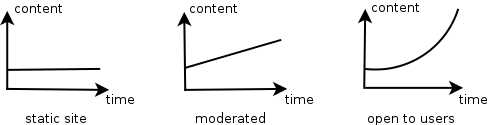

Preface
=======

## HTTP APIs

In the world of information technologies everything revolves around... information. And Web is a very great way to disseminate information. The ability of users to access information has value.

Consider a small example. Suppose that you have a website and you monetize it by advertising on the site pages. The more content (or data or information) you have and the higher quality it (the more interesting it is for users), the more money you earn. If your site is static (always the same amount of the same pages) you do not have a lot of options to increase profits. You can hire moderators (or yourself to be a moderator) to create new content. Moderators increase the amount of content linearly.

You may want to increase the speed of content creation. And you decide to open access for users. If users will be motivated to add new content to your site, the amount of content will grow exponentially, because the more content you have - the more users you have, and the more users you have - the more new content they create.

And there is more! Now you can interact with other sites or services to allow users of other web-sites get access your content. The more simple and convenient way to look at - the more successful will be your website. Hard to imagine...

This is not the only area of application HTTP APIs. There are projects that internally constructed of small web-services that interact with each other using APIs. That kind of project can also be called API. The architecture of such a project is called service-oriented architecture, which is the subject of this book.

## RPC vs REST

So if you need to grant access to your application for some other applications that can be supported by other developers, and can be written in different programming languages, you must provide the HTTP API. In general, it is a finite list of remote calls (or methods or procedures) with its specification.

It is advisable to use some well-known or intuitive interface. One option is to use XML-RPC (Remote Procedure Call), it uses XML to encode messages - methods and data in XML. XML-RPC is a certain protocol for method and data transmitted over HTTP.

HTTP is the protocol itself. `REST` (Representational State Transfer) completely relies on HTTP. URL is used to determine resource type or unique resource item. HTTP method (such as `POST`, `GET`, `PUT`, `DELETE`) is used to determine method (Create, Read, Update, Delete). This set of atomic methods must be sufficient to carry out any desired operation. Comparing to REST XML-RPC is like envelope with the data (Top level XML) placed in another envelope (HTTP).

In this book we will follow `REST` conventions.

## Technologies

In this book, we will not compare different technologies that can be used to create web services.

We will focus on general architecture of web-service. We will use ruby language, it is concise and understandable. Also we will use `sinatra` framework and related `ruby` gems.

To start reading the book, you should have a `ruby` (1.9 or later), and RubyGems installed on your system.

Data serialization format - mostly JSON.

## Code examples

You can find code examples used in book on [github](https://github.com/shhavel/service-oriented-architecture-in-practice).

## Acknowledgments

I want to thank the managers and all the engineers of [Facewatch](https://www.facewatch.co.uk/cms/). This book exists because of the Facewatch and [Aejis](http://aejis.eu) team.
