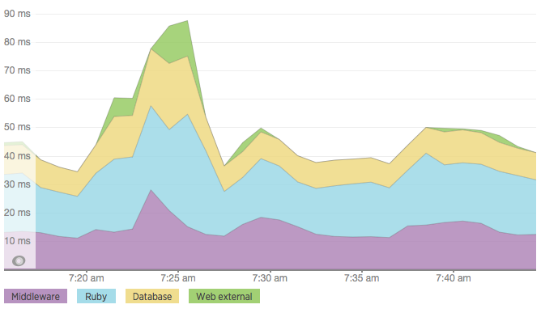
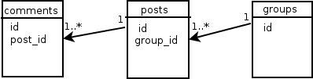
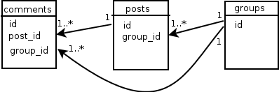

Chapter #10. Profiling
======================

Generally speaking, when you create a web service, you must make sure that the application is really a relatively independently of other web resources and contain encapsulated logic. Remote HTTP requests cause performance degradation, as well as complicate the internal testing of the application. Try to minimize the number of remote HTTP-requests when processing the request to the web service. E.g. do not load remote user for particular action if web-service works the same for registered and not-registered users.

One way to make sense of what parts of the application are the slowest is profiling.

## <a name="ruby-built-in-profiler"></a>Ruby built-in profiler

You can use built-in `ruby` profiler with option `-r profile` from command line:

    $ ruby -r profile application.rb

Or you can do it manually [from application code](http://stackoverflow.com/questions/4347466/whats-the-best-way-to-profile-a-sinatra-application)

## <a name="ruby-prof"></a>ruby-prof

We will profile Zip-codes service. Add gem `ruby-prof` into `Gemfile`:

```ruby
source 'https://rubygems.org'

gem 'rake'
gem 'sinatra', require: 'sinatra/main'
gem 'rack-contrib', git: 'https://github.com/rack/rack-contrib'
gem 'pg'
gem 'activerecord'
gem 'protected_attributes'
gem 'sinatra-activerecord'
gem 'sinatra-param'
gem 'faraday'
gem 'sinatra-can'
gem 'ruby-prof'

group :development, :test do
  gem 'thin'
  gem 'pry-debugger'
  gem 'rspec_api_documentation'
end

gem 'ransack'

group :test do
  gem 'rspec'
  gem 'shoulda'
  gem 'factory_girl'
  gem 'database_cleaner'
  gem 'rack-test'
  gem 'faker'
  gem 'fakeweb'
end
```

And run

    $ bundle install

We will profile action `update` of web-service. Add this code into file `app/controllers/zip_codes_controller.rb`:

```ruby
put "/api/v1/zip_codes/:id.json" do
  # Profile the code
  RubyProf.start unless RubyProf.running?

  param :id, Integer, max: 2147483647
  param :zip_code, Hash, required: true
  load_and_authorize! ZipCode
  @zip_code.update_attributes!(params[:zip_code]) if params[:zip_code].any?
  response = @zip_code.to_json

  result = RubyProf.stop
  # Print a flat profile to text
  printer = RubyProf::FlatPrinter.new(result)
  printer.print(STDOUT)

  response
end
```

Add a delay of 15 seconds in the `users` web service. Here is the updated file `service.rb`:

```ruby
require "sinatra/main"

get "/api/v1/users/me.json" do
  content_type :json
  sleep 15 # timeout delay

  case request.env['HTTP_AUTHORIZATION']
  when nil then [403, '{"message":"Access Forbidden"}']
  when "OAuth 562f9fdef2c4384e4e8d59e3a1bcb74fa0cff11a75fb9f130c9f7a146a003dcf"
    then '{"user":{"type":"AdminUser"}}'
  when "OAuth b259ca1339e168b8295287648271acc94a9b3991c608a3217fecc25f369aaa86"
    then '{"user":{"type":"RegularUser"}}'
  else [401, '{"message":"Invalid or expired token"}']
  end
end
```

Run `users` web-service on port 4545:

    $ ruby service.rb -p 4545

Then run Zip-codes service (on default port 4567):

    $ ruby application.rb

Editing an existing Zip-code from another terminal window (or tab):

    $ curl "http://localhost:4567/api/v1/zip_codes/401.json" \
       -X PUT \
       -H "Authorization: OAuth 562f9fdef2c4384e4e8d59e3a1bcb74fa0cff11a75fb9f130c9f7a146a003dcf" \
       -H "Content-Type: application/json" \
       -d '{"zip_code":{"street_name":"Wuckert Mall","building_number":"2294"}}'

    {"zip_code":{"id":401,"zip":"63109","street_name":"Wuckert Mall","building_number":"2294","city":"New Hoyt","state":"Utah","created_at":"2015-02-15T09:02:25.374Z","updated_at":"2015-03-23T11:43:25.475Z"}}

Look at the terminal where Zip-codes service is running:

    $ %self      total      self      wait     child     calls  name
       6.54     15.003     0.991    14.012     0.000        1   <Class::IO>#select
       0.33      0.050     0.050     0.000     0.000       90   Array#join
       0.13      0.020     0.020     0.000     0.000       14   PG::Connection#async_exec
       0.05      0.008     0.008     0.000     0.000       99   Module#module_eval
       0.03      0.005     0.005     0.000     0.000        1   PG::Connection#initialize
       0.03      0.005     0.004     0.000     0.001        1   ActiveRecord::QueryMethods#where!
       0.02      0.002     0.002     0.000     0.000        3   ActiveModel::Validations#errors
       0.02      0.079     0.002     0.000     0.077      215  *Array#each

       ...

       0.00     15.007     0.000     0.000    15.007        1   Faraday::Connection#get

This information is a little difficult to read, but you can see that the HTTP remote call was performed for 15 seconds.

## <a name="new-relic"></a>New Relic

Another good profiling tool is `New Relic`. You should have registered account at `New Relic` site to use it. After setting it you can monitor you application statistics.



Execution time is divided into sections: `Middleware`, `Ruby`, `Database`, `Web external`.

The installation process is not complicated: add gem `newrelic_rpm` into `Gemfile` (`production` section), run `bundle install` and add config file `config/newrelic.yml` with credentials.

## <a name="partial-denormalization"></a>Partial denormalization in a relational database

If the application uses a relational database, you can sometimes improve performance by reducing the count of SQL queries on a single HTTP request or decrease of number of `JOIN`-s in SQL queries.

We will show this on example. Imagine application that has such models: `Group`, `Post`, `Comment` and database tables behind them: `groups`, `posts`, `comments`. Group contains many posts and each post can have many comments. The database table `posts` contains column `group_id`, which is a foreign key in relation to the table `groups`. Look at this UML diagram.



Application contains the operation for editing comment and only user which is the manager of the group has the ability to edit the comment associated with the post of this group. Thus, each time the application must find an appropriate post to the comment and check it `group_id`.

We can make a partial denormalization to prevent the execution of an additional query - add a column `group_id` to the table `comments`.



Thus, we can reduce the number of queries to the database.

Attribute `group_id` is immutable for the `Post`. So, we can redefine method `#post_id=` in class `Comment`.

```ruby
class Comment
  belongs_to :post

  validates_presence_of :post

  def post_id=(value)
    write_attribute(:post_id, value)
    write_attribute(:group_id, post.try(:group_id))
    value
  end
end
```

Also good practice can be considered the installation of foreign keys (`post_id` and `group_id`) as "not NULL" in the database, if the model checks for the presence of the association.

## <a name="summary"></a>Summary

We used gem [ruby-prof](https://github.com/ruby-prof/ruby-prof) for profiling `sinatra` application. We briefly discussed the `New Relic` and considered the technique of partial normalization in relational databases to improve application performance.
