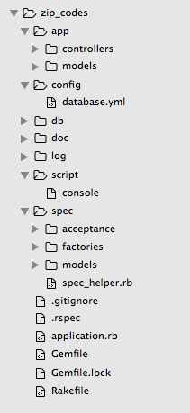

Глава #5. JSON веб-сервисы
==========================

Веб-сервисы могут использовать различные форматы для сериализации данных. Наиболее распространенными являются XML и JSON. JSON - простой формат, который к тому же прекрасно подходит для JavaScript-приложений, которые работают в веб-браузере. Одним из ограничений при использовании JSON является отсутствие встроенной возможности указывать типы данных (например, `String`, `Integer`, `Array`). Клиент должен самостоятельно определять тип данных. В большинстве случаев это очевидно и обрабатывается JSON парсером.

Пример данных в JSON формате:

    {"name":"Lyric Adams","account":208.6,"orders":[456,803,1204],"address":"871 Tommie Roads","city":"Halchester","birthday":"1986-05-07","registeration_date":"2015-02-23"}

Те же данные с отступами:

    {
      "name": "Lyric Adams",
      "account": 208.6,
      "orders": [456,803,1204],
      "address": "871 Tommie Roads",
      "city": "Halchester",
      "birthday": "1986-05-07",
      "registeration_date": "2015-02-23"
    }

Здесь представленны данные о клиенте в виде хранилища ключ-значение. Анализатор (парсер) JSON способен определить типы некоторых атрибутов: `"Lyric Adams"` - строка, `208.6` - число с плавающей точкой, `[456,803,1204]` - массив целых чисел. Атрибуты `"birthday"` и `"registeration_date"` содержат строковые значения. Типы данных для даты и времени представлены в виде строк в формате JSON.

Есть по крайней мере два способа для того, чтобы преобразовать все строки с датой в тип данных для даты: проверить все значения, которые соответствуют регулярному выражению для даты и времени и преобразовать их, или конвертировать только значения из заданного списка ключей (вы должны знать заранее, откуда-то, все ключи, которые содержат значения даты и времени).

Несколько следующих глав посвящены разработке веб-сервиса для управления Zip-кодами (почтовые индексы США). В этой главе мы создадим сервис, который предоставляет данные в формате JSON и обрабатывает данные в формате JSON из запросов.

## <a name="create-zip-codes-service-structure"></a>Создание структуры сервиса Zip-кодов

Создайте, пожалуйста, папку `zip_codes` где-то в вашей системе. Создайте папки `app`, `config`, `db`, `doc`, `log`, `script`, `spec`. Создайте папку `models` и `controllers` внутри папки `app`, а также создайте папки `acceptance`, `factories`, `models` внутри папки `spec`. Создайте файл `config/database.yml` с вашими настройками базы данных, вот моя версия:

```yaml
development:
  adapter: postgresql
  encoding: unicode
  database: zipcodes_development
  username: alex

test:
  adapter: postgresql
  encoding: unicode
  database: zipcodes_test
  username: alex
```

Создайте файл `script/console`

```ruby
#!/bin/bash

# parameter: RACK_ENV
bundle exec irb -r ./application.rb
```

И сделайте его исполняемым (для UNIX-подобных систем):

    $ chmod +x script/console

Создайте файл `spec/spec_helper.rb`

```ruby
ENV['RACK_ENV'] = 'test'
require File.expand_path("../../application", __FILE__)

FactoryGirl.find_definitions

RSpec.configure do |config|
  config.include Rack::Test::Methods
  config.include FactoryGirl::Syntax::Methods
  config.default_formatter = 'doc' if config.files_to_run.one?

  def app
    Sinatra::Application
  end

  config.before(:suite) do
    DatabaseCleaner.clean_with :truncation
    DatabaseCleaner.strategy = :transaction
  end

  config.before(:each) do
    DatabaseCleaner.start
  end

  config.after(:each) do
    DatabaseCleaner.clean
  end
end

require "rspec_api_documentation/dsl"

RspecApiDocumentation.configure do |config|
  config.docs_dir = Pathname.new(Sinatra::Application.root).join("doc")
  config.app = Sinatra::Application
  config.api_name = "Zip-Codes API"
  config.format = :html
  config.curl_host = 'https://zipcodes.example.com'
  config.curl_headers_to_filter = %w(Host Cookie)
end
```

Обратите внимание, что мы обновили конфигурацию для гема `rspec_api_documentation`. Параметр настройки `curl_host` важен, если он установлен документация будет содержать `curl` пример, который часто используется для отладки веб-сервисов.

Если вы используете `git` добавьте файл `.gitignore` внутрь папки `zip_codes`.

    log/*.log
    doc/*

А также вы можете добавить пустой файл с именем `.keep` (или `.gitkeep`) внутрь папок `log`, `doc` и `lib/tasks` (мы не создавали последнюю папку).

Создайте файл `Gemfile` внутри папки `zip_codes`

```ruby
source 'https://rubygems.org'

gem 'rake'
gem 'sinatra', require: 'sinatra/main'
gem 'pg'
gem 'activerecord'
gem 'protected_attributes'
gem 'sinatra-activerecord'

group :development, :test do
  gem 'thin'
  gem 'pry-debugger'
  gem 'rspec_api_documentation'
end

group :test do
  gem 'rspec'
  gem 'shoulda'
  gem 'factory_girl'
  gem 'database_cleaner'
  gem 'rack-test'
  gem 'faker'
end
```

И выполните

    $ bundle install

Создайте файл `Rakefile`

```ruby
require_relative 'application'
require 'sinatra/activerecord/rake'

unless ENV['RACK_ENV'].to_s == 'production'
  require 'rspec_api_documentation'
  load 'tasks/docs.rake'
end
```

Создайте файл `application.rb` внутри папки `zip_codes`

```ruby
require 'bundler/setup'
Bundler.require :default, (ENV['RACK_ENV'] || :development).to_sym
puts "Loaded #{Sinatra::Application.environment} environment"

set :root, File.dirname(__FILE__)
use Rack::CommonLogger, File.new(File.join(settings.root, 'log',
  "#{settings.environment}.log"), 'a+').tap { |f| f.sync = true }

Dir[File.join(settings.root, "app/{models,controllers}/*.rb")].each { |f| require f }
```

Вы также можете создать файл `.rspec` с настройками для RSpec

    --color
    --require spec_helper

Строка `--require spec_helper` позволяет автоматически подключить файл `spec_helper.rb` во все тестовые файлы. Таким образом, вы можете не указывать явно `require "spec_helper"` в каждом тестовом файле (мы будем добавлять это в любом случае).

Посмотрите на структуру созданного приложения:



## <a name="create-databases"></a>Создание баз данных

Если вы ещё не создали `development` и` test` базы данных, выполните `rake db:create` (в терминале из папки `zip_codes`). Это создаст обе базы данных.

## <a name="create-model-and-migration"></a>Создание модели и миграции

Мы создадим одну модель для Zip-кодов с пятью атрибутами: ZIP, название улицы, номер здания, город, штат. Все атрибуты являются строками. Атрибут ZIP является обязательным (не может быть пустым) и должен соответствовать (проверяться) следующему регулярному выражению: `/\A\d{5}(?:-\d{4})?\Z/` (5 цифр или 9 цифр разделенных символом "-" после 5-й цифры).

Создайте, пожалуйста, миграцию, выполните следующую `rake` задачу:

    $ rake db:create_migration NAME=create_zip_codes

Обновление кода миграции (файл, который был создан в папке `db/migrate`):

```ruby
class CreateZipCodes < ActiveRecord::Migration
  def change
    create_table :zip_codes do |t|
      t.string :zip, null: false
      t.string :street_name
      t.string :building_number
      t.string :city
      t.string :state

      t.timestamps null: false
    end

    add_index :zip_codes, :zip
  end
end
```

Выполните миграцию для `development` и `test` базы данных

    $ rake db:migrate
    $ RACK_ENV=test rake db:migrate

Теперь мы можем создать модель - файл `app/models/zip_code.rb`

```ruby
class ZipCode < ActiveRecord::Base
  validates :zip, presence: true
  validates_format_of :zip, with: /\A\d{5}(?:-\d{4})?\Z/

  attr_accessible :zip, :street_name, :building_number, :city, :state
end
```

И тесты для модели - файл `spec/models/zip_code_spec.rb`

```ruby
require "spec_helper"

describe ZipCode do
  describe "validations" do
    it { should validate_presence_of(:zip) }

    it { is_expected.to allow_value('12345').for(:zip) }
    it { is_expected.to allow_value('12345-1234').for(:zip) }
    it { is_expected.not_to allow_value('123ab').for(:zip) }
    it { is_expected.not_to allow_value('123456').for(:zip) }
    it { is_expected.not_to allow_value('12345-123').for(:zip) }
  end

  describe 'assignament' do
    it { is_expected.not_to allow_mass_assignment_of(:id) }
    it { is_expected.to allow_mass_assignment_of(:zip) }
    it { is_expected.to allow_mass_assignment_of(:street_name) }
    it { is_expected.to allow_mass_assignment_of(:building_number) }
    it { is_expected.to allow_mass_assignment_of(:city) }
    it { is_expected.to allow_mass_assignment_of(:state) }
  end
end
```

Вы можете запустить тесты командой `rspec`.

Создайте, пожалуйста, файл `spec/factories/zip_codes.rb` с фабрикой для создания Zip-кодов в тестах. Мы будем использовать её в ближайшее время в `acceptance` тестах.

```ruby
FactoryGirl.define do
  factory :zip_code do
    zip { Faker::Address.zip }
    street_name { Faker::Address.street_name }
    building_number { Faker::Address.building_number }
    city { Faker::Address.city }
    state { Faker::Address.state }
  end
end
```

Мы использовали гем [faker](https://github.com/stympy/faker) для генерации различных атрибутов модели.

## <a name="top-level-interface-planning"></a>Планирование интерфейса верхнего уровня

Веб-сервис должен возвращать JSON представление Zip-кода и быть в состоянии обрабатывать JSON закодированные параметры для создания/обновления Zip-кода.

Получение Zip-кода: запрос и ответ.

    $ curl "https://localhost:4567/api/v1/zip_codes/53796.json" -X GET

    {"zip_code":{"id":2,"zip":"53796","street_name":"Johnston Forest",
    "building_number":"463","city":"Mosciskiville","state":"Connecticut",
    "created_at":"2015-02-09T15:20:42.474Z","updated_at":"2015-02-09T15:20:42.474Z"}}

Создание Zip-кода: запрос и ответ.

    $ curl "https://localhost:4567/api/v1/zip_codes.json" \
    $ -X POST \
    $ -H "Content-Type: application/json" \
    $ -d '{"zip_code":{"zip":"31460-3046","street_name":"Cartwright Dale", \
    $ "building_number":"77779","city":"Ovaside","state":"South Dakota"}}'

    {"zip_code":{"id":1,"zip":"31460-3046","street_name":"Cartwright Dale",
    "building_number":"77779","city":"Ovaside","state":"South Dakota",
    "created_at":"2015-02-09T15:20:42.440Z","updated_at":"2015-02-09T15:20:42.440Z"}}

Функционал для JSON-сериализации включён в гем `activerecord`. Для большего количества возможностей настройки, вы можете использовать [active_model_serializers](https://github.com/rails-api/active_model_serializers) или [JBuilder](https://github.com/rails/jbuilder).

Для разбора JSON из тела `POST` или `PUT` HTTP запроса, мы можем использовать `Rack::PostBodyContentTypeParser` `middleware` из [rack-contrib](https://github.com/rack/rack-contrib).

Веб-сервис должен также передавать HTTP заголовок `Content-Type: application/json` в каждом ответе.

## <a name="create-controller"></a>Создание контроллера

Добавим `rack-contrib` в `Gemfile`. Мы будем использовать новейшую версию из GitHub.

```ruby
source 'https://rubygems.org'

gem 'rake'
gem 'sinatra', require: 'sinatra/main'
# use Rack::PostBodyContentTypeParser to add support for JSON request bodies
gem 'rack-contrib', git: 'https://github.com/rack/rack-contrib'
gem 'pg'
gem 'activerecord'
gem 'protected_attributes'
gem 'sinatra-activerecord'

group :development, :test do
  gem 'thin'
  gem 'pry-debugger'
  gem 'rspec_api_documentation'
end

group :test do
  gem 'rspec'
  gem 'shoulda'
  gem 'factory_girl'
  gem 'database_cleaner'
  gem 'rack-test'
  gem 'faker'
end
```

Измените `application.rb` для того, чтобы добавить поддержку для разбора JSON-тела HTTP запроса с помощью `Rack::PostBodyContentTypeParser` `middleware`, укажите заголовок HTTP ответа `"Content-Type: application/json"`, а также добавьте опцию конфигурации для метода `ActiveRecord::Base#to_json`.

```ruby
require 'bundler/setup'
Bundler.require :default, (ENV['RACK_ENV'] || :development).to_sym
puts "Loaded #{Sinatra::Application.environment} environment"

set :root, File.dirname(__FILE__)
use Rack::CommonLogger, File.new(File.join(settings.root, 'log',
  "#{settings.environment}.log"), 'a+').tap { |f| f.sync = true }

Dir[File.join(settings.root, "app/{models,controllers}/*.rb")].each { |f| require f }

# Support for JSON request bodies
use Rack::PostBodyContentTypeParser

# Adds "Content-Type: application/json" HTTP header in response
before { content_type :json }

# Configure method ActiveRecord::Base#to_json to add root node at top level,
# e.g. {"zip_code":{"zip": ... }}
ActiveRecord::Base.include_root_in_json = true
```

`Rack::PostBodyContentTypeParser` преобразует JSON, что передается в теле запроса HTTP в хэш `params`.

Создайте, пожалуйста, файл `app/controllers/zip_codes_controller.rb` с четырьмя CRUD-операциями для управления Zip-кодами.

```ruby
post "/api/v1/zip_codes.json" do
  zip_code = ZipCode.new(params[:zip_code])
  zip_code.save!
  status 201
  zip_code.to_json
end

get "/api/v1/zip_codes/:zip.json" do
  zip_code = ZipCode.find_by_zip!(params[:zip])
  zip_code.to_json
end

put "/api/v1/zip_codes/:id.json" do
  zip_code = ZipCode.find(params[:id])
  zip_code.update_attributes!(params[:zip_code])
  zip_code.to_json
end

delete "/api/v1/zip_codes/:id.json" do
  zip_code = ZipCode.find(params[:id])
  zip_code.destroy!
end
```

И `acceptance` тесты в файле `spec/acceptance/zip_codes_spec.rb`

```ruby
require "spec_helper"

resource 'ZipCode' do
  post "/api/v1/zip_codes.json" do
    header "Content-Type", "application/json"

    parameter :zip, "Zip", scope: :zip_code, required: true
    parameter :street_name, "Street name", scope: :zip_code
    parameter :building_number, "Building number", scope: :zip_code
    parameter :city, "City", scope: :zip_code
    parameter :state, "State", scope: :zip_code
    let(:raw_post) { params.to_json }

    # let(:valid_attributes) do
    #   { zip: "35761-7714", street_name: "Lavada Creek",
    #       building_number: "88871", city: "New Herminaton", state: "Rhode Island" }
    # end
    let(:valid_attributes) { attributes_for(:zip_code) }
    let(:new_zip_code) { ZipCode.last }

    example "Create Zip Code" do
      do_request(zip_code: valid_attributes)
      json_response = JSON.parse(response_body, symbolize_names: true)

      expect(status).to eq 201
      expect(json_response[:zip_code].values_at(*valid_attributes.keys)).to eq valid_attributes.values
      expect(new_zip_code).to be_present
      expect(new_zip_code.attributes.values_at(*valid_attributes.keys.map(&:to_s))).to eq valid_attributes.values
    end
  end

  get "/api/v1/zip_codes/:zip.json" do
    parameter :zip, "Zip", scope: :zip_code, required: true

    let(:zip_code) { create(:zip_code) }

    example "Read Zip Code" do
      do_request(zip: zip_code.zip)
      json_response = JSON.parse(response_body, symbolize_names: true)

      expect(status).to eq 200
      expect(json_response[:zip_code].values_at(:id, :zip, :street_name, :building_number, :city, :state)).to eq(
        zip_code.attributes.values_at('id', 'zip', 'street_name', 'building_number', 'city', 'state'))
    end
  end

  put "/api/v1/zip_codes/:id.json" do
    header "Content-Type", "application/json"

    parameter :id, "Record ID", required: true
    parameter :street_name, "Street name", scope: :zip_code
    parameter :building_number, "Building number", scope: :zip_code
    parameter :city, "City", scope: :zip_code
    parameter :state, "State", scope: :zip_code
    let(:raw_post) { params.to_json }

    let(:zip_code) { create(:zip_code) }
    let(:valid_attributes) { attributes_for(:zip_code) }

    example "Update Zip Code" do
      do_request(id: zip_code.id, zip_code: valid_attributes)
      json_response = JSON.parse(response_body, symbolize_names: true)

      expect(status).to eq 200
      expect(json_response[:zip_code].values_at(:zip, :street_name, :building_number, :city, :state)).to eq(
        valid_attributes.values_at(:zip, :street_name, :building_number, :city, :state))
      expect(zip_code.reload.attributes.values_at(*valid_attributes.keys.map(&:to_s))).to eq valid_attributes.values
    end
  end

  delete "/api/v1/zip_codes/:id.json" do
    parameter :id, "Record ID", required: true

    let(:zip_code) { create(:zip_code) }

    example "Delete Zip Code" do
      do_request(id: zip_code.id)

      expect(status).to eq 200
      expect(ZipCode.where(id: zip_code.id)).to be_empty
    end
  end
end
```

Вот и все! (на время). Мы создали веб-сервис, который работает, но не включает в себя обработку неверного ввода. Мы сделаем это в следующей главе.

## <a name="summary"></a>Резюме

Мы использовали метод `to_json` из `activerecord` для JSON-сериализации и `middleware` из [rack-contrib](https://github.com/rack/rack-contrib) для десериализации (разбора) JSON параметров из POST/PUT HTTP-запросов.

Мы также создали `acceptance` тесты. Почти каждый тест проверяет правильность конкретных JSON-атрибутов, и мы используем `JSON.parse` в каждом тесте. Вы, наверное, должны иметь вспомогательный-метод для этого, вот полезная статья: [Rails API Testing Best Practices](http://matthewlehner.net/rails-api-testing-guidelines/) (несмотря на "Rails" в названии, статья содержит инструкции, которые могут быть использованы в каждом `rspec` + `rack-test` тестах).

Некоторые гемы для тестирования JSON:

* [json_spec](https://github.com/collectiveidea/json_spec)
* [airborne](https://github.com/brooklynDev/airborne)
* [json_expressions](https://github.com/chancancode/json_expressions)
* [match_json](https://github.com/WhitePayments/match_json)

Чтобы сохранять чёткие и поддерживаемые тесты, я могу предложить проверять только основные атрибуты в примерах с одной записью и проверять только идентификаторы (IDs) для примеров с коллекцией записей.
