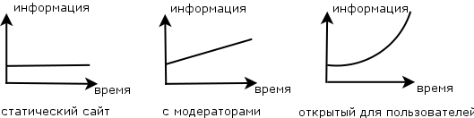

Предисловие
===========

## HTTP APIs

В мире информационных технологий всё вращается вокруг... информации. И Интернет является очень отличным способом распространения информации. Способность пользователей получать доступ к информации имеет значение.

Рассмотрим небольшой пример. Предположим, что у вас есть сайт и вы заробатываете размещая рекламу на страницах сайта. Чем больше контента (или данных, или информации) у вас есть и чем более высокого он качества (чем интереснее он для пользователей), тем больше денег вы зарабатываете. Если ваш сайт является статическим (всегда то же самое количество тех же страниц) вы не имеете много вариантов, чтобы увеличить прибыль. Вы можете нанять модераторов (или сами быть модератором) для того, чтобы создавать новое содержимое. Работа модераторов увеличивает количество контента линейно.

Вы можете захотеть увеличить скорость создания контента. И вы решите открыть доступ для пользователей. Если пользователи будут мотивированы для добавления нового контента на вашем сайте, количество контента будет расти в геометрической прогрессии, потому что, чем больше контента у вас есть - тем больше пользователей у вас будет, и чем больше пользователей у вас есть - тем больше нового контента они создают.

И еще! Теперь вы можете взаимодействовать с другими сайтами или службами, чтобы позволить пользователям других веб-сайтов получить доступ к содержимому. Чем более простой и удобный способ Вы найдете - тем более успешным окажется ваш веб сайт. Трудно себе представить...

Это не единственная область применения HTTP API. Есть проекты, которые внутренне состоят из маленьких веб-сервисов, которые взаимодействуют друг с другом с помощью API. Такого рода проект можно также назвать API. Архитектура такого проекта называется сервис-ориентированной архитектурой, которой посвящена эта книга.

## RPC и REST

Так что, если вам нужно предоставить доступ к вашему приложению для некоторых других приложений, которые могут поддерживаться другими разработчиками и могут быть написаны на различных языках программирования, то Вы должны предоставить HTTP API. В целом это конечный список удаленных вызовов (или методов, или процедур) со своей спецификацией.

Желательно использовать некоторый хорошо известный или интуитивно понятный интерфейс. Одним из вариантов является использование XML-RPC (Remote Procedure Call), он использует XML для кодирования сообщений - методы и данные в формате XML. XML-RPC - это определенный протокол для метода и данных, передаваемых по HTTP.

HTTP также является протоколом. `REST` (сокр. от англ. Representational State Transfer — передача состояния представления) полностью полагается на HTTP. URL используется для определения типа ресурса или уникальной записи ресурса. Метод HTTP (например, `POST`, `GET`, `PUT`, `DELETE`) используется для определения метода (создание, чтение, обновление, удаление). Этого набора атомных методов должно быть достаточно для того, чтобы выполнить любую нужную операцию. По сравнению с REST XML-RPC, как конверт с данными (Верхний уровень XML), размещенных в другой конверт (HTTP).

В этой книге мы будем следовать `REST` конвенциям.

## Технологии

В этой книге мы не будем сравнивать различные технологии, которые могут быть использованы для создания веб-сервисов.

Мы сосредоточимся на общей архитектуре веб-сервиса. Мы будем использовать язык программирования Ruby. Ruby - лаконичный и понятный язык программирования. Также мы будем использовать `sinatra` фреймворк и связанные с ним `ruby` гемы.

Чтобы начать читать книгу, вы должны иметь `ruby` (1.9 или более новый), и RubyGems установленными в вашей системе.

Формат сериализации данных - в основном JSON.

## Примеры кода

Вы можете найти примеры кода, используемые в книге на [GitHub](https://github.com/shhavel/service-oriented-architecture-in-practice).

## Благодарности

Я хочу поблагодарить менеджеров и всех инженеров компании [Facewatch](https://www.facewatch.co.uk/cms/). Эта книга существует благодаря команде Facewatch и [Aejis](http://aejis.eu).
