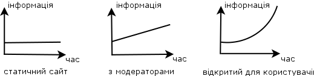

Передмова
=========

## HTTP APIs

У світі інформаційних технологій все обертається навколо... інформації. І Інтернет є дуже добрим способом поширення інформації. Здатність користувачів отримувати доступ до інформації має значення.

Розглянемо невеликий приклад. Припустимо, що у вас є сайт і ви монетизувати його розміщуючи рекламу на сторінках сайту. Чим більше контенту (або даних, або інформація) у вас є і чим більш високої він якості (чим цікавіше він для користувачів), тим більше грошей ви заробляєте. Якщо ваш сайт є статичним (завжди та ж сама кількість тих же сторінок) ви не маєте багато варіантів, щоб збільшити прибуток. Ви можете найняти модераторів (або самі бути модератором) для того, щоб створювати новий контент. Робота модераторів збільшує кількість контенту лінійно.

Ви можете захотіти збільшити швидкість створення контенту. І ви вирішите відкрити доступ для користувачів. Якщо користувачі будуть мотивовані для додавання нового контенту на вашому сайті, кількість контенту буде рости в геометричній прогресії, тому що, чим більше контенту у вас є - тим більше користувачів у вас буде, і чим більше користувачів у вас є - тим більше нового контенту вони створюють.

І ще! Тепер ви можете взаємодіяти з іншими сайтами або службами, щоб дозволити користувачам інших веб-сайтів отримати доступ до контенту. Чим більш простий і зручний спосіб Ви знайдете - тим більш успішним виявиться ваш веб сайт. Важко собі уявити...

Це не єдина область застосування HTTP API. Є проекти, які внутрішньо складаються з маленьких веб-сервісів, які взаємодіють один з одним за допомогою API. Такого роду проект можна також назвати API. Архітектура такого проекту називається сервіс-орієнтованою архітектурою, якій присвячена ця книга.

## RPC и REST

Так що, якщо вам потрібно надати доступ до вашого додатком для деяких інших програм, які можуть підтримуватися іншими розробниками і можуть бути написані на різних мовах програмування, то Ви повинні надати HTTP API. В цілому це кінцевий список віддалених викликів (або методів, або процедур) зі своєю специфікацією.

Бажано використовувати деякий добре відомий чи інтуїтивно зрозумілий інтерфейс. Одним з варіантів є використання XML-RPC (Remote Procedure Call), він використовує XML для кодування повідомлень - методи і дані у форматі XML. XML-RPC - це певний протокол для методу і даних, передаваних по HTTP.

HTTP також є протоколом. `REST` (скор. Від англ. Representational State Transfer - передача стану подання) повністю покладається на HTTP. URL використовується для визначення типу ресурсу або унікальною запису ресурсу. Метод HTTP (наприклад, `POST`,` GET`, `PUT`,` DELETE`) використовується для визначення методу (створення, читання, оновлення, видалення). Цього набору атомних методів повинно бути достатньо для того, щоб виконати будь-яку потрібну операцію. У порівнянні з REST XML-RPC, як конверт з даними (Верхній рівень XML), розміщених в інший конверт (HTTP).

У цій книзі ми будемо слідувати `REST` конвенціям.

## Технології

У цій книзі ми не будемо порівнювати різні технології, які можуть бути використані для створення веб-сервісів.

Ми зосередимося на загальній архітектурі веб-сервісу. Ми будемо використовувати мову Ruby, Ruby - лаконічний і зрозумілий. Також ми будемо використовувати `sinatra` фреймворк і пов'язані з ним `ruby` геми.

Щоб почати читати книгу, ви повинні мати `ruby` (1.9 або новіший), і RubyGems встановленими у вашій системі.

Формат серіалізациі даних - в основному JSON.

## Приклади коду

Ви можете знайти приклади коду, використовувані в книзі на [GitHub](https://github.com/shhavel/service-oriented-architecture-in-practice).

## Подяки

Я хочу подякувати менеджерам і всім інженерам компанії [Facewatch](https://www.facewatch.co.uk/cms/). Ця книга існує завдяки команді Facewatch та [Aejis](http://aejis.eu).
